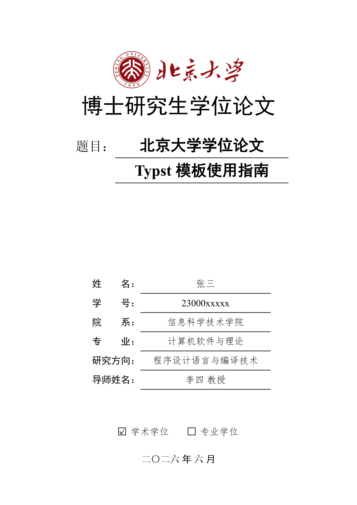

# pkuthss-typst

北京大学学位论文 Typst 模板 / Typst template for dissertations in Peking University (PKU).



📄 **[在线预览 PDF](https://pku-typst.github.io/pkuthss-typst/thesis.pdf)** | **[盲审版本](https://pku-typst.github.io/pkuthss-typst/thesis-blind.pdf)**

## 快速开始

1. 安装 [Typst](https://github.com/typst/typst)（v0.14.0+）
2. 克隆仓库：
   ```bash
   git clone https://github.com/pku-typst/pkuthss-typst.git
   cd pkuthss-typst
   ```
3. 编辑 `thesis.typ`，填写论文信息和正文
4. 编译：
   ```bash
   typst compile thesis.typ --font-path fonts
   ```

## 命令行参数

支持通过命令行切换编译模式，无需修改源文件：

```bash
# 生成盲审版本
typst compile thesis.typ --font-path fonts --input blind=true

# 生成打印版（链接不着色）
typst compile thesis.typ --font-path fonts --input preview=false

# 章节不强制从奇数页开始
typst compile thesis.typ --font-path fonts --input alwaysstartodd=false
```

## 文档

`thesis.typ` 本身即为完整的使用文档，包含：

- 模板配置选项说明
- Typst 基本语法教程
- 常见问题解答
- 进阶使用技巧

## 许可

MIT License
